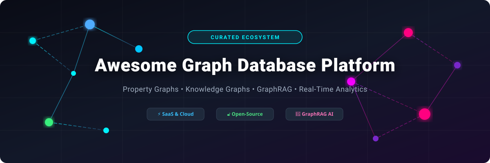

# 🌐 Awesome Graph Database Platform 🚀

  
  
  
  
  
  

> **Curated Ecosystem of Top Graph Database Platforms, Knowledge Graph Engines, and GraphRAG Storage Solutions** 📊 Network Analytics, Property Graphs & Real-Time Relationship Intelligence

---

## 📌 Overview

This repository tracks notable **SaaS platforms** ☁️ and **open-source projects** 🔓 for **Graph Databases**. These database systems store, index, and query highly connected data structures for knowledge graphs, fraud detection, recommendation engines, network analysis, GraphRAG (Retrieval-Augmented Generation), and real-time relationship intelligence.

---

## 📈 Market Size & Industry Dynamics

> 💡 **Market Insights**: The global Graph Database market is estimated at **~$3.2 Billion in 2025/2026** and projected to exceed **$11.8 Billion by 2032** (CAGR ~20.5%). The sector is **moderately fragmented**, with pioneer incumbents (Neo4j, AWS Neptune) leading enterprise market share while specialized vector-graph and GraphRAG platforms (Memgraph, FalkorDB, Kùzu) rapidly capture modern AI/LLM developer workloads.

---

## ☁️ SaaS / Managed Hosted Platforms

Below is a breakdown of top managed cloud graph database platforms, sorted by estimated company valuation / scale (descending).

| Platform 🚀 | Description 📝 | Company Scale / Valuation 🏢 | Starting Paid Tier Price 💳 | Free Tier / Trial Limits 🎁 |
| :--- | :--- | :--- | :--- | :--- |
| **[Azure Cosmos DB (Gremlin API)](https://azure.microsoft.com/en-us/products/cosmos-db)** | Multi-model Microsoft cloud database with Gremlin graph API support for globally distributed workloads. | **~$3.1 Trillion** (Microsoft Market Cap) | ~$24/mo (400 RU/s provisioned minimum) | 1,000 RU/s throughput + 25 GB storage forever free |
| **[Amazon Neptune](https://aws.amazon.com/neptune/)** | Fully managed AWS graph database service supporting property graph (openCypher/Gremlin) and RDF (SPARQL). | **~$2.2 Trillion** (Amazon Market Cap) | ~$0.348/hr (~$250/mo for `db.t4g.medium` base compute) | 30-day Free Trial (750 hrs `db.t3.medium` + 10GB storage) |
| **[Neo4j Aura](https://neo4j.com/cloud/aura/)** | Managed cloud service of the leading property graph engine with Cypher and Graph Data Science. | **~$2.3 Billion** ($200M+ ARR) | ~$65/mo (AuraDB Professional 1GB instance) | 200,000 nodes & 400,000 relationships (Forever Free) |
| **[TigerGraph Cloud](https://www.tigergraph.com/)** | Distributed native graph database built for deep link analytics, fraud detection, and enterprise GraphRAG. | **~$800 Million** ($170M+ Funding) | ~$0.60/hr (~$430/mo base provisioned compute) | "Savanna Free" tier (1 R/W workspace, 32 vCPU, 256GB RAM) |
| **[ArangoDB Oasis](https://www.arangodb.com/)** | Managed multi-model database (document + graph + search) with native graph query capabilities. | **~$200 Million** ($50M+ Funding) | ~$45/mo (Standard cloud instance) | 14-day Free Cloud Trial (No credit card required) |
| **[Ontotext GraphDB](https://www.ontotext.com/products/graphdb/)** | RDF / semantic graph database platform for enterprise knowledge graphs and linked data. | **~$100 Million** (Enterprise Subsidiary) | ~$1,200/year (Small Enterprise license) | Free Edition limited to 2 concurrent queries & 1 node |
| **[Dgraph Cloud](https://dgraph.io/)** | GraphQL-native distributed graph database with horizontal scalability and ACID transactions. | **~$50 Million** ($25M+ Funding) | $39.99/mo (Shared production cluster) | 30-day Free Trial (1 Shared cluster up to 5GB storage) |
| **[Memgraph Cloud](https://memgraph.com/)** | High-performance in-memory graph database optimized for real-time analytics and GraphRAG. | **~$40 Million** ($14.2M Funding) | ~$0.08/hr (~$58/mo base cloud instance) | 14-day Free Trial (1 Project up to 2 GB RAM) |
| **[FalkorDB Cloud](https://www.falkordb.com/)** | High-performance GraphRAG database (openCypher) built on ultra-low-latency Redis data structures. | **~$20 Million** ($6M+ Funding) | $73/mo (Startup tier) | Free Tier for MVPs (1 Instance up to 100MB RAM) |
| **[TerminusDB Cloud](https://terminusdb.com/)** | Knowledge-graph and document database with Git-like revision control and collaboration. | **~$15 Million** ($4.5M Funding) | ~$50/mo (Hosted team workspace) | Free Forever Community Cloud Tier (Up to 100MB project) |

---

## 🔓 Open-Source GitHub Projects

Here are the top open-source graph databases and frameworks, sorted by GitHub Stars_Count (descending).

| Project 📦 | Description 📝 | Stars ⭐ | Primary Model / Language 🛠️ |
| :--- | :--- | :--- | :--- |
| **[Neo4j (Community Edition)](https://github.com/neo4j/neo4j)** | The most popular open-source property graph database with Cypher query language and ACID compliance. |  | Property Graph / Cypher, Java |
| **[Dgraph](https://github.com/dgraph-io/dgraph)** | Horizontally scalable, distributed graph database with native GraphQL support and high traversals. |  | Distributed Graph / GraphQL, Go |
| **[NebulaGraph](https://github.com/vesoft-inc/nebula)** | Distributed, fast open-source graph database capable of hosting super-large-scale graphs with nGQL. |  | Distributed Graph / nGQL, C++ |
| **[ArangoDB](https://github.com/arangodb/arangodb)** | Open-source multi-model database combining native graph storage, JSON documents, and search in one engine. |  | Multi-Model / AQL, C++ |
| **[HugeGraph](https://github.com/apache/hugegraph)** | Apache top-level project providing a high-performance distributed graph database supporting Gremlin. |  | Distributed Graph / Gremlin, Java |
| **[Memgraph](https://github.com/memgraph/memgraph)** | High-performance in-memory graph database, Cypher-compatible, optimized for real-time analytics & GraphRAG. |  | In-Memory Graph / Cypher, C++ |
| **[OrientDB](https://github.com/orientechnologies/orientdb)** | Multi-model database with strong graph capabilities, document storage, and SQL-like query interface. |  | Multi-Model / SQL-Graph, Java |
| **[Kùzu](https://github.com/kuzudb/kuzu)** | Embeddable, extremely fast C++ property graph database optimized for GraphRAG and analytical workloads. |  | Embeddable Graph / Cypher, C++ |
| **[Apache TinkerPop / Gremlin](https://github.com/apache/tinkerpop)** | Graph computing framework and Gremlin traversal language standard used across graph platforms. |  | Graph Framework / Gremlin, Java |
| **[JanusGraph](https://github.com/JanusGraph/janusgraph)** | Open-source distributed graph database supporting Gremlin traversals with Cassandra, HBase, or BerkeleyDB backends. |  | Distributed Graph / Gremlin, Java |
| **[AGE (Apache AGE)](https://github.com/apache/age)** | PostgreSQL extension that enables graph database capabilities with Cypher query support on top of Postgres. |  | Postgres Graph Extension / Cypher, C |
| **[TerminusDB](https://github.com/terminusdb/terminusdb)** | Open-source knowledge graph and document graph database featuring Git-like versioning and revision control. |  | Revision Control Graph / WOQL, Prolog / C |
| **[FalkorDB](https://github.com/FalkorDB/FalkorDB)** | Low-latency graph database engine utilizing openCypher and optimized Redis data structures for AI memory & GraphRAG. |  | Low-Latency Graph / openCypher, C |
| **[ArcadeDB](https://github.com/ArcadeData/arcadedb)** | Multi-model database engine supporting Graph, Document, Key-Value, Vector, and Time-Series data in one engine. |  | Multi-Model / Cypher / Gremlin / SQL, Java |

---

## 🛠️ Selection Guide & Architectural Patterns

- ⚡ **For In-Memory / Low-Latency GraphRAG**: Choose **Memgraph** or **FalkorDB**.
- 🏢 **For Enterprise Enterprise Cloud Graph**: Choose **Neo4j Aura** or **Amazon Neptune**.
- 📦 **For Embedded Applications / Local Python AI Tools**: Choose **Kùzu**.
- 🐘 **For PostgreSQL Native Graph**: Choose **Apache AGE**.
- 🌐 **For Distributed Massive Scale**: Choose **NebulaGraph**, **JanusGraph**, or **HugeGraph**.

---

## 🤝 How to Contribute

1. Fork the repository 🍴
2. Add or update entries in `README.md` (keep descriptions factual and linked to official repos/sites).
3. Ensure formatting matches the existing markdown tables.
4. Open a Pull Request 📥 with a short explanation.

---

## 💙 Support & Community

If you find this curated list helpful, please consider supporting the project! 🌟

- ⭐ **Star** this repository on GitHub
- 🔄 **Share** with data engineering and GraphRAG communities
- 💖 **Sponsor**: Buy me a coffee via [GitHub Sponsors](https://github.com/sponsors/ishandutta2007)

---

## 📈 Star History

---

## ⚠️ Disclaimer

This is a community-curated list for informational purposes. All product names, logos, and brands are property of their respective owners.
